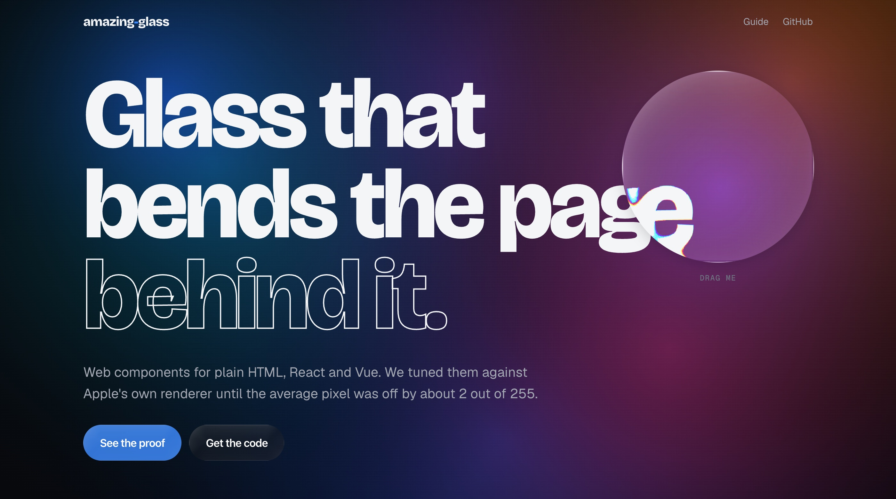
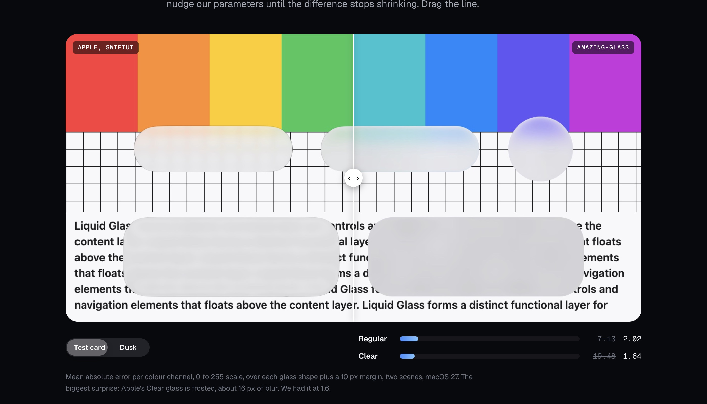
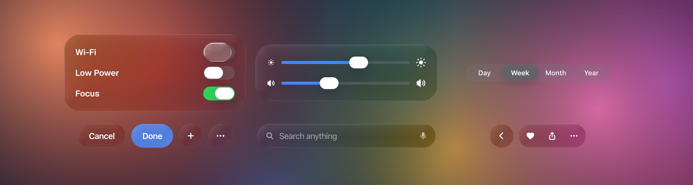

<div align="center">

# amazing-glass

**Glass that bends the page behind it.**

Web components for plain HTML, React and Vue. Real refraction, tuned against Apple's own renderer until the average pixel was off by about 2 out of 255.

[Live demo](https://tomacco.github.io/amazing-glass/) · [How it works](https://tomacco.github.io/amazing-glass/how/) · [Guide](https://tomacco.github.io/amazing-glass/guide/) · [API](docs/API.md) · [For AI agents](AGENTS.md)



</div>

## The short version

Most "glass" on the web is a blurred box. This is a slab with a curved rim that bends light like glass does. We checked it against Apple's glass pixel by pixel, then wrapped it in ten ready-made controls. You can drop them into any page in about two lines.

Three things make that true.

### 1. It refracts. Blur alone is not glass.

Every glass shape gets a height profile: a curved rim that flattens into a slab. For each pixel we take the slope of that rim, bend a view ray with Snell's law (index 1.5, window glass), and store how far the ray moved. Chromium applies that map to whatever sits behind the element, three times with slightly different strength, one per colour channel. That is where the thin rainbow at the rim comes from.

No WebGL. No screenshots of the page. The effect is live over real DOM: text, video, your app.

### 2. We measured it against Apple's.

A small SwiftUI app draws Apple's `.glassEffect(.regular)` and `.glassEffect(.clear)` over two test images. A web page draws ours over the same images, at the same sizes. We screenshot both and let a fitter tune our parameters until the difference stops shrinking.



| Variant | Error before fitting | Error after |
|---|---:|---:|
| Regular | 7.13 | **2.02** |
| Clear | 19.48 | **1.64** |

Mean absolute error per colour channel on a 0 to 255 scale, over each glass shape plus a 10 px margin, two scenes, macOS 27. The rig lives in [`lab/`](lab/), so you can rerun it and tell us we are wrong.

Plot twist from the data: Apple's Clear glass is frosted, around 16 px of blur. We had it at 1.6. The fitter was not impressed.

### 3. The controls are ready.



| Element | What it does |
|---|---|
| `<ag-glass>` | A glass surface for your own content |
| `<ag-button>` | Capsule button; `prominent` is stained glass in your accent colour |
| `<ag-switch>` | The knob turns into a lens while you hold it |
| `<ag-slider>` | The thumb swells into a lens so the fill stays visible |
| `<ag-segmented>` | Tap to jump with a liquid stretch, or drag the selection |
| `<ag-tab-bar>` | Floats; drag across it and the selection follows as a lens; shrinks on scroll |
| `<ag-menu>` | The button becomes the menu, grown out of its own corner |
| `<ag-sheet>` | Medium detent floats inset; large goes flush and more opaque |
| `<ag-alert>` | Leading-aligned text, side-by-side capsule actions |
| `<ag-search>` | Search field on a glass capsule |
| `<ag-toolbar>` | Related actions share one capsule; groups float apart |

Every one of them works with a mouse, a finger and a keyboard, and respects reduced motion, reduced transparency and increased contrast settings.

## Quick start

### Any page

```html
<link rel="stylesheet" href="https://cdn.jsdelivr.net/gh/tomacco/amazing-glass@main/dist/amazing-glass.css">
<script type="module" src="https://cdn.jsdelivr.net/gh/tomacco/amazing-glass@main/dist/amazing-glass.min.js"></script>

<ag-glass variant="clear">Anything you like</ag-glass>
<ag-switch checked></ag-switch>
<ag-segmented options="Day,Week,Month" value="Week"></ag-segmented>
```

### React

```bash
npm i github:tomacco/amazing-glass
```

```tsx
import { useState } from 'react';
import 'amazing-glass/styles.css';
import { Glass, Switch, Segmented } from 'amazing-glass/react';

export function Settings() {
  const [on, setOn] = useState(true);
  const [period, setPeriod] = useState('Week');
  return (
    <Glass variant="regular" params={{ blur: 8 }}>
      <Switch checked={on} onChange={setOn} />
      <Segmented options={['Day', 'Week', 'Month']} value={period} onChange={setPeriod} />
    </Glass>
  );
}
```

Handlers get the new value first and the DOM event second. Need glass on an element you render yourself? `useGlass(ref, { variant: 'clear' })`.

### Vue

```vue
<script setup>
import { ref } from 'vue';
import 'amazing-glass/styles.css';
import { Glass, Switch, Segmented, vGlass } from 'amazing-glass/vue';
const on = ref(true);
const period = ref('Week');
</script>

<template>
  <Glass variant="clear">
    <Switch v-model="on" />
    <Segmented :options="['Day', 'Week', 'Month']" v-model="period" />
  </Glass>
  <div v-glass="{ variant: 'regular' }">Glass on any element</div>
</template>
```

Svelte, Solid, Angular, htmx or a PHP template from 2009: use the elements directly. They are standard custom elements. There is also a `glass(node, options)` helper that doubles as a Svelte action.

## Make it yours

Three levels, from coarse to fine.

**Pick a preset.** `variant="regular"` frosts for legibility, `clear` keeps the content visible, `lens` magnifies. Add `tint="#34c759"` for stained glass, or `dim` on clear glass over bright photos.

**Override tokens.** Colours, type and radii are CSS custom properties.

```css
:root { --ag-accent: #ff2d55; --ag-switch-on: #ff2d55; }
ag-sheet { --ag-sheet-radius: 32px; }
```

**Tune the physics.** Every number the material uses is a parameter.

```html
<ag-glass params='{"depth": 1.6, "dispersion": 0.25, "blur": 3}'></ag-glass>
```

```ts
import { Glass } from 'amazing-glass/core';
const glass = new Glass(element, { variant: 'clear' });
glass.setParams({ bezel: 0.5, ior: 1.7 });
```

The full list, with units, is in [docs/API.md](docs/API.md#material-parameters). The [guide](https://tomacco.github.io/amazing-glass/guide/) has every component live next to its reference.

## Where it works

Every feature has a support level. **Stable** works everywhere, with a documented fallback where a browser lacks something. **Limited** has a stable API but shows the full effect only in some browsers. **Experimental** works, may still change, and is opt-in. The table below is generated from `src/core/support.ts`, and your code can ask the same question at runtime:

```ts
import { featureStatus } from 'amazing-glass/core';
featureStatus('refraction-dom'); // { level: 'limited', available: true } in Chrome
```

<!-- support:start -->
| Feature | Level | Chrome, Edge, Arc | Safari | Firefox |
|---|---|---|---|---|
| Glass material: frost, tint, rim light, adaptive ink | **Stable** | Full | Full | Full |
| All ag-* components, React and Vue bindings | **Stable** | Full | Full | Full |
| Refraction over page content<br><sub>Needs SVG filters inside backdrop-filter, which only Chromium runs.</sub> | **Limited** | Full | Fallback: frost, tint, rim | Fallback: frost, tint, rim |
| Refraction over canvases passed to registerBackdrop() | **Stable** | Full (SVG filter) | Full (CPU) | Full (CPU) |
| Liquid merging: GlassField<br><sub>Costs CPU every frame while shapes move (about 8 ms per frame on a desktop for four shapes).</sub> | **Limited** | Full | Over registered canvases only (CPU) | Over registered canvases only (CPU) |
| Liquid merging on the GPU: GlassField renderer "webgl"<br><sub>Bends only the backdrop canvas you pass, not page elements above it. Falls back to the SVG path without WebGL2.</sub> | **Experimental** | Full | Expected (WebGL2), untested | Expected (WebGL2), untested |

- **Stable:** Works in every current browser, with a documented fallback where a browser lacks something. API stable.
- **Limited:** API stable. The full effect only in the browsers listed; the others get the fallback.
- **Experimental:** Works, but the API or look may change in a minor version. Opt-in.

Where each was actually checked:

- Glass material: Chrome; Safari and Firefox via the same CSS path in forced-fallback mode.
- All ag-* components, React and Vue bindings: Chrome desktop and mobile emulation, React 19, Vue 3.5.
- Refraction over page content: Chrome, and measured against SwiftUI on macOS.
- Refraction over canvases passed to registerBackdrop(): Chrome; the CPU path by forcing it in Chrome, not yet in Safari or Firefox themselves.
- Liquid merging: Chrome desktop and mobile emulation.
- Liquid merging on the GPU: Chrome desktop and mobile emulation.
<!-- support:end -->

Add `?ag-fallback` to any URL to see the Safari and Firefox fallback in Chrome.

### Experimental: liquid merging on the GPU

`GlassField` normally rebuilds its images on the CPU every frame. When the content behind the glass is a canvas you draw, it can run as one WebGL2 shader instead. In our benchmark that took main-thread time from about 15 ms to 0.05 ms per frame, and the frame rate from 57 to the display's cap. The demo hero uses it.

```ts
const field = new GlassField(overlay, { renderer: 'webgl', backdrop: myCanvas, merge: 46 });
field.renderer; // 'webgl', or 'svg' if WebGL2 was not available
field.setShapes([{ x: 200, y: 150, w: 160, h: 160, r: 80 }, { x: 330, y: 170, w: 70, h: 70, r: 35 }]);
```

The catch: it only bends what is in `backdrop`. Page elements above that canvas are not part of it, so keep them above the glass layer. That is why it is experimental.

## The fine print

We would rather you hear these from us.

- **The reference is macOS.** The fit ran against SwiftUI on macOS 27. iOS tunes its glass differently. The lens knobs and dark mode are hand-tuned, not measured yet.
- **One backdrop rule to know.** If a parent of a glass element has `opacity` below 1, a `filter`, a `mask` or `mix-blend-mode`, the browser hides what is behind it from the glass. Animate `transform` on parents instead. The components already do.
- **Liquid merging is CPU work** on the stable path: about 8 ms per frame on a desktop for four moving shapes. Over a canvas you draw, the experimental GPU renderer makes it nearly free.
- **Not SF Symbols.** The icons are our own drawings. SF Symbols are licensed for Apple platforms only. Bring your own with `registerIcon()`.
- **Not affiliated with Apple.** Liquid Glass is Apple's design language, and their [Human Interface Guidelines](https://developer.apple.com/design/human-interface-guidelines/materials) were the reference for every control. This is an independent project.

## Repository map

```
src/core/       the material: optics, maps, filter, fallback, Glass, GlassField
src/elements/   the <ag-*> custom elements
src/react/      React wrappers and useGlass
src/vue/        Vue components and v-glass
src/styles/     tokens, material and component CSS
apps/demo/      the landing page
apps/guide/     the technical guide (and the source of docs/API.md)
lab/            SwiftUI reference renderer and the fitter
tests/          unit tests for the optics
```

## Develop

```bash
bun install
bun run build        # library into dist/, sites into site/, docs/API.md
bun run dev          # serves the repo on http://localhost:5180/site/
bun test             # optics and preset tests
bun run typecheck
```

Contributions welcome. Read [CONTRIBUTING.md](CONTRIBUTING.md) first; it is short. If you write docs, read [docs/VOICE.md](docs/VOICE.md) too. It bans em dashes, and we mean it.

## Licence

MIT. Do good things with it.
